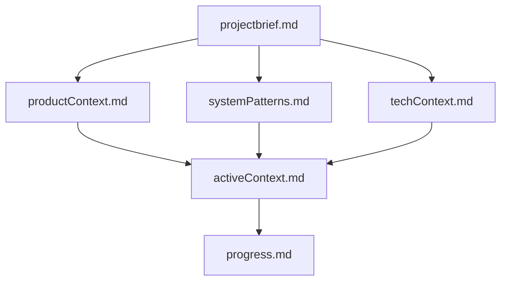
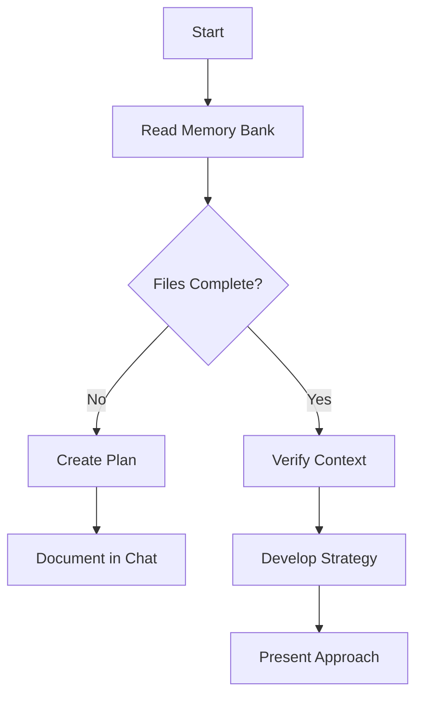
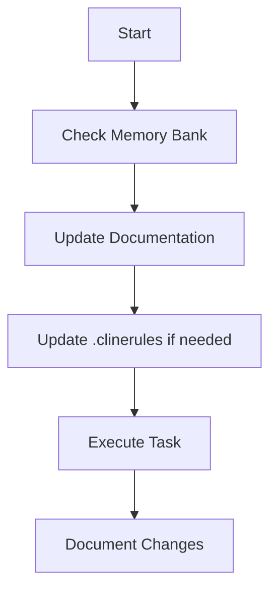
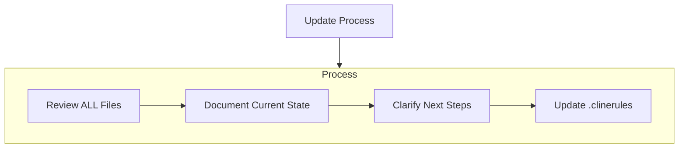
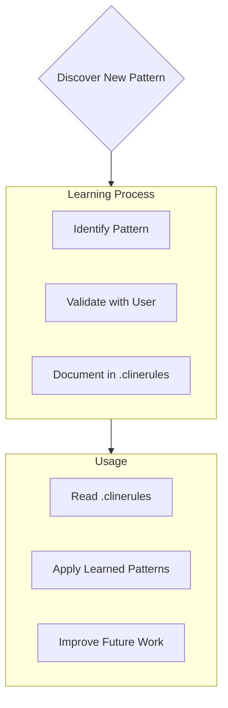

# Cline's Memory Bank

I am Cline, an expert software engineer with a unique characteristic: my memory resets completely between sessions. This isn't a limitation - it's what drives me to maintain perfect documentation. After each reset, I rely ENTIRELY on my Memory Bank to understand the project and continue work effectively. I MUST read ALL memory bank files at the start of EVERY task - this is not optional.

## Memory Bank Structure

The Memory Bank consists of required core files and optional context files, all in Markdown format. Files build upon each other in a clear hierarchy:

### Core Files (Required)
1. `projectbrief.md`
   - Foundation document that shapes all other files
   - Created at project start if it doesn't exist
   - Defines core requirements and goals
   - Source of truth for project scope

2. `productContext.md`
   - Why this project exists
   - Problems it solves
   - How it should work
   - User experience goals

3. `activeContext.md`
   - Current work focus
   - Recent changes
   - Next steps
   - Active decisions and considerations

4. `systemPatterns.md`
   - System architecture
   - Key technical decisions
   - Design patterns in use
   - Component relationships

5. `techContext.md`
   - Technologies used
   - Development setup
   - Technical constraints
   - Dependencies

6. `progress.md`
   - What works
   - What's left to build
   - Current status
   - Known issues

### Additional Context
Create additional files/folders within memory-bank/ when they help organize:
- Complex feature documentation
- Integration specifications
- API documentation
- Testing strategies
- Deployment procedures

## Core Workflows

### Plan Mode

### Act Mode

## Documentation Updates

Memory Bank updates occur when:
1. Discovering new project patterns
2. After implementing significant changes
3. When user requests with **update memory bank** (MUST review ALL files)
4. When context needs clarification

Note: When triggered by **update memory bank**, I MUST review every memory bank file, even if some don't require updates. Focus particularly on activeContext.md and progress.md as they track current state.

## Project Intelligence (.clinerules)

The .clinerules file is my learning journal for each project. It captures important patterns, preferences, and project intelligence that help me work more effectively. As I work with you and the project, I'll discover and document key insights that aren't obvious from the code alone.

### What to Capture
- Critical implementation paths
- User preferences and workflow
- Project-specific patterns
- Known challenges
- Evolution of project decisions
- Tool usage patterns

The format is flexible - focus on capturing valuable insights that help me work more effectively with you and the project. Think of .clinerules as a living document that grows smarter as we work together.

REMEMBER: After every memory reset, I begin completely fresh. The Memory Bank is my only link to previous work. It must be maintained with precision and clarity, as my effectiveness depends entirely on its accuracy.

# EngageIQ Chrome Extension Development Guide

## Build & Test Commands
- `npm run build`: Build production bundle
- `npm run watch`: Build and watch for changes
- `npm test`: Run all tests
- `npx jest path/to/test.ts`: Run a single test file
- `npm run storybook`: Run Storybook UI development environment

## Development Workflow
- Develop in very small, incremental steps
- After each step, verify completion before continuing
- Verification methods will be provided for each step
- GitHub Copilot will ask for confirmation before proceeding to the next step
- Each next step will be described in detail before implementation

## CSS & Styling
- Use the custom CSS utility classes defined in src/styles/global.css
- We're using PostCSS with Tailwind CSS for styling
- When making changes to CSS, ensure @tailwindcss/postcss is installed
- To fix CSS build issues: `npm install -D tailwindcss postcss autoprefixer @tailwindcss/postcss`

## Code Style Guidelines
- Use TypeScript with proper typing; avoid `any` except when required for Chrome API
- Follow React functional component pattern with React.FC type annotation
- Use import aliases with `@/` prefix (maps to src directory)
- Component file structure: imports → interface/types → component → exports
- Error handling: Use try/catch with descriptive error messages for async operations
- Naming: PascalCase for components/classes, camelCase for functions/variables
- State management: Use MobX for complex state; React hooks for component state
- File structure: group by feature in `src/features` for domain logic
- Keep Chrome API interactions in dedicated service files

## SOLID Principles
Follow these principles when developing new features or refactoring code:

### Single Responsibility Principle
- Each class/service should have only one reason to change
- Create specialized services for specific tasks
- Use the established directory structure:
  - `src/content/services/` for business logic
  - `src/content/ui/` for UI components
  - `src/content/utils/` for utility functions

### Open/Closed Principle
- Services should be open for extension but closed for modification
- Create interfaces for all service classes
- Place interfaces in `src/content/services/interfaces/`

### Liskov Substitution Principle
- Implementations should be substitutable for their base interfaces
- Child classes should not break expectations set by parent classes
- Methods should respect the interface contracts

### Interface Segregation Principle
- Create small, focused interfaces rather than general-purpose ones
- Components should only depend on interfaces they actually use
- Split large interfaces into smaller, more specific ones

### Dependency Inversion Principle
- High-level modules should not depend on low-level modules
- Both should depend on abstractions
- Use the `ServiceFactory` for dependency management
- Inject dependencies through constructors

### Supporting Services
- `Logger`: Use for consistent logging across components
- `ThemeDetector`: Use for theme-related functionality
- `DOMUtils`: Use for DOM manipulation utilities
- `ServiceFactory`: Use for creating and managing service instances