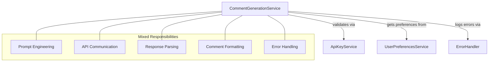
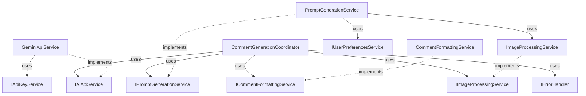
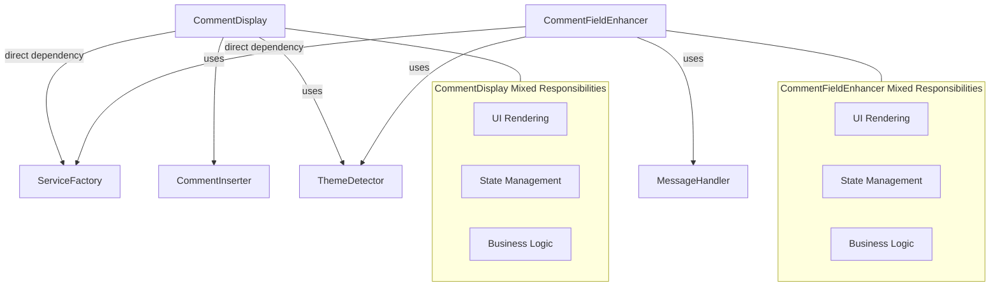
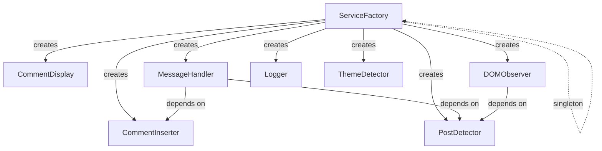
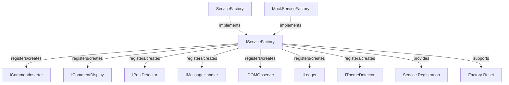

# Refactoring Targets: Before and After

This document visualizes the key refactoring targets in the EngageIQ Chrome Extension, showing the current architecture compared to the proposed refactored architecture.

## CommentGenerationService Refactoring

The `CommentGenerationService` will be split into smaller, focused services with clear responsibilities.

### Before

### After

## UI Component Refactoring

The UI components will be refactored to separate business logic from UI rendering.

### Before

### After

```mermaid
graph TD
    %% UI Components
    commentDisplayComp["CommentDisplayComponent"]
    commentFieldEnhComp["CommentFieldEnhancerComponent"]
    
    %% Service Interfaces
    ICommentDisplaySvc["ICommentDisplayService"]
    ICommentFieldEnhSvc["ICommentFieldEnhancerService"]
    
    %% State Management
    IDisplayState["ICommentDisplayStateManager"]
    IEnhancerState["IButtonStateManager"]
    
    %% Service Implementations
    commentDisplaySvc["CommentDisplayService"]
    commentFieldEnhSvc["CommentFieldEnhancerService"]
    
    %% Implementations
    commentDisplaySvc -.->|implements| ICommentDisplaySvc
    commentFieldEnhSvc -.->|implements| ICommentFieldEnhSvc
    
    %% Dependencies
    ICommentInserter["ICommentInserter"]
    IThemeDetector["IThemeDetector"]
    IMessageHandler["IMessageHandler"]
    
    %% Component Dependencies
    commentDisplayComp -->|uses| ICommentDisplaySvc
    commentDisplayComp -->|uses| IDisplayState
    
    commentFieldEnhComp -->|uses| ICommentFieldEnhSvc
    commentFieldEnhComp -->|uses| IEnhancerState
    
    %% Service Dependencies
    commentDisplaySvc -->|uses| ICommentInserter
    commentDisplaySvc -->|uses| IThemeDetector
    
    commentFieldEnhSvc -->|uses| IMessageHandler
    commentFieldEnhSvc -->|uses| IThemeDetector
```

## ServiceFactory Refactoring

The ServiceFactory will be redesigned to support dependency injection and interfaces.

### Before

### After

These diagrams visualize the key architectural changes that will be implemented as part of the refactoring process, showing how the current monolithic services will be broken down into smaller, more focused components with proper interfaces and dependency injection. 