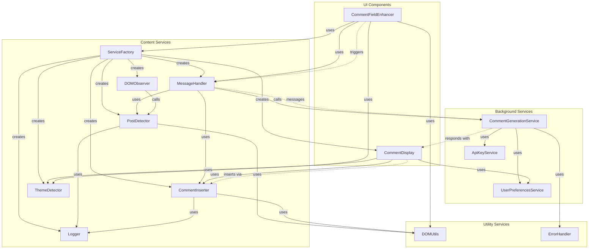

# Current Service Architecture

This diagram represents the current service architecture of the EngageIQ Chrome Extension, showing the relationships and dependencies between services.

## Key Architecture Issues

1. **ServiceFactory Centralization**
   - ServiceFactory creates and manages all content services, creating a central dependency
   - No abstractions for many services, making testing difficult
   - UI components directly access ServiceFactory

2. **Mixed Responsibilities**
   - CommentGenerationService handles multiple responsibilities (prompt generation, API communication, formatting)
   - UI components have business logic embedded (CommentDisplay, CommentFieldEnhancer)
   - MessageHandler mixes communication and business logic

3. **Limited Interface Usage**
   - Only some services have interfaces (CommentInserter, PostDetector, CommentDisplay)
   - Static utility classes prevent proper testing (DOMUtils, ErrorHandler)
   - No dependency injection for most services

4. **Hard-Coded Dependencies**
   - Direct dependencies on Chrome API and DOM structure
   - Hard-coded selectors for LinkedIn elements
   - Limited extensibility for new functionality

## Proposed Architecture

A future architecture diagram will be created showing how the refactored services will interact with proper interfaces and cleaner separation of concerns. 